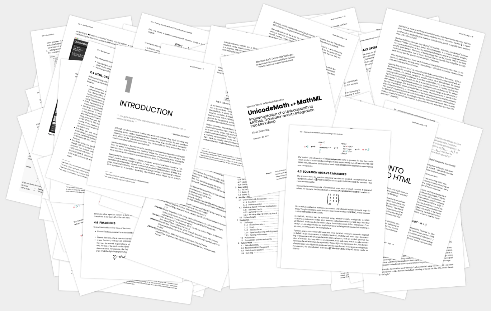

# markdeep-thesis

*Write your (under)graduate thesis with [Markdeep](https://casual-effects.com/markdeep/) and typeset it right in your browser.*

* Supports **all features [Markdeep](https://casual-effects.com/markdeep/) has to offer** – diagrams, math, fancy quotes, footnotes, citations, admonitions, and all the standard Markdown stuff.
* Fills in **page numbers**, generates a nice-looking **table of contents** and supports **footnotes** courtesy of [Bindery](https://evanbrooks.info/bindery/).
* A **highly readable layout** – but if you don't like it or want to adjust things: **Style your thesis with CSS!** LaTeX is great, but things can get tricky if you really want to make a `documentclass` your own.
* Your browser's built-in print tools allow you to **export your thesis to a PDF file** ready for printing – see "Exporting to PDF" below for more information.

#### 💻 [Try out a demo thesis](https://ghpages.noahdoersing.com/markdeep-thesis/demo.md.html), see the [exported PDF](demo.md.html.pdf) and take a look at its [Markdeep source code](demo.md.html).

*Also, check out [markdeep-slides](https://github.com/doersino/markdeep-slides) and [markdeep-diagram-drafting-board](https://github.com/doersino/markdeep-diagram-drafting-board)!*



*Pages of [my own Master's thesis](https://github.com/doersino/UnicodeMathML/blob/master/docs/doersing-unicodemath-to-mathml.pdf), which provided the impetus for building this tool. (In case you're curious as to how this image was generated, you'll surely be delighted to know that I've written [a blog post about it](https://excessivelyadequate.com/posts/scattered.html).)*


## Getting started

### Setup

This repository contains **copies of all dependencies** (Markdeep, Bindery, MathJax, and the webfonts used in the default layout) by design – it'll **work offline** just fine.

#### 📦 Clone this repository or [download a ZIP](https://github.com/doersino/markdeep-thesis/archive/master.zip).

Then simply...

1. **navigate** to `demo.md.html`,
2. **open** it in your text editor and browser of choice,
3. **fill in** your data in the `titlePage` variable, and
4. **start writing your thesis**. Easy!


### Options

At the bottom of `demo.md.html`, smack in the middle of where a bunch of essential JavaScript files are loaded, you'll find a set of options. Their default values (each of which is automatically applied if you *omit* the corresponding option) are:

```html
<script>
markdeepThesisOptions = {

    // Default view during authoring: "print", "preview", or "flipbook".
    view: "print",

    // Let `markdeep-thesis` know about the `titlePage` variable set during
    // step 3 of the setup instructions above.
    titlePage: titlePage,

    // Base font size, in `pt`. Everything is defined relative to this value.
    fontSize: 10.5,

    // Page/paper size: the default is A4.
    pageSize: {width: '21cm', height: '29.7cm'},

    // Margins between content and edge of paper. A bit wide, but in the spirit
    // of (La)TeX, I guess.
    pageMargins: {top: '2.5cm', inner: '3.5cm', outer: '2.5cm', bottom: '2.5cm'},

    // Extra rules passed to Bindery's `Bindery.makeBook` function. Useful for
    // preventing page breaks: `Bindery.PageBreak({selector: '.someClass',
    // position: 'avoid'})`. See
    // https://evanbrooks.info/bindery/docs/#flowing-content
    // for more info.
    extraBinderyRules: [],

    // Definition of running header, see:
    // https://evanbrooks.info/bindery/docs/#runningheader
    runningHeader: (p => `${p.number}`),

    // Scale factor for markdeep diagrams.
    markdeepDiagramScale: 1.0,

    // A number of hooks that you can utilize for custom pre- or postprocessing
    // steps. No-ops by default.
    hookAfterMarkdeep:               Function.prototype,
    hookAfterMarkdeepPostprocessing: Function.prototype,
    hookAfterMathJax:                Function.prototype,
    hookAfterMathJaxPostprocessing:  Function.prototype,
    hookAfterBindery:                Function.prototype
};
</script>
```

**Modify them to your liking**, but don't decrease the font size too much (your advisor won't appreciate having to use a magnifying glass). Additionally, you can tweak the layout by overriding CSS definitions or modifying `markdeep-thesis/style.css` in-place.


### Exporting to PDF

It's best to **use Chrome for generating a PDF version** of your thesis – it respects the page size that you've configured (unlike all other browsers). In Chrome's print window, *set "Margins" to "None"* and *make sure to keep the "Background graphics" option enabled*.

In my experience, once you've dialled in this print configuration, you can [run Chrome headlessly](https://developers.google.com/web/updates/2017/04/headless-chrome) for future exports (you may need to boost the `--virtual-time-budget` depending on the complexity of your thesis):

```
chrome --headless --disable-gpu --print-to-pdf=demo.md.html.pdf --no-margins --virtual-time-budget=10000 demo.md.html
```


## Contributing

Got an idea on how to improve something? Ran into unexpected behavior? Found a bug? (Maybe even fixed that bug?)

*Please [file an issue](https://github.com/doersino/markdeep-thesis/issues) or send a pull request! I'll be glad to take a look at it.*

**I'd love to [hear from you](https://hejnoah.com/about.html) (or take a peek at your thesis) if you've used this tool in practice.**


---


### Notes

* The first two pages of the document – the title page and the empty page after it – are intentionally lacking page numbers. Page numbers commence with "1" on page 3 of the document.
* A horizontal rule `---` forces a page break or two: The content will continue on the next odd-numbered page. (`<span class="pagebreak"></span>` forces a simple page break.) If you want to insert a *visible* horizontal rule that does not result in any page breaks, type `<hr class="ignore">`.
* This tool converts Markdeep's endnotes into footnotes. Multiple references to an endnote turn into multiple, distinct footnotes.
* Similarly, the target URLs of links specified using Markdown are shown in footnotes.
* Note that Markdeep's [`insert` functionality](https://casual-effects.com/markdeep/features.md.html#including/insertingotherdocuments) does not play well with this tool.
* Also note that this tool includes no fancy (e.g. BibTeX-style) way of managing references – it doesn't extend Markdeep's capabilities in this respect. You'll need to manually make sure that your formatting is consistent if that's something you or your advisor cares about. (This is certainly a feature that would be neat to integrate!)
* It would also be neat (although Markdeep should ideally include this functionality) to have a way of linking to sections such that the link markup is automatically replaced with section numbers.


### License

You may use this repository's contents under the terms of the *BSD 2-Clause "Simplified" License*, see `LICENSE`.

However, the subdirectory `markdeep-thesis/lib/` contains **third-party software with its own licenses**:

* Morgan McGuire's **Markdeep** is *also* licensed under the *BSD 2-Clause "Simplified" License*, see [here](https://casual-effects.com/markdeep/#license).
* Markdeep includes Ivan Sagalaev's **highlight.js** with its *BSD 3-Clause License*, see [here](https://github.com/highlightjs/highlight.js/blob/master/LICENSE).
* **Bindery** is used in accordance with its *MIT License*, see [here](https://github.com/evnbr/bindery/blob/master/LICENSE).
* **MathJax** is licensed under the *Apache License 2.0*, see [here](https://github.com/mathjax/MathJax/blob/master/LICENSE).
* All included **webfonts** (PT Serif, Poppins, Iosevka, PT Sans Narrow, Aleo) are licensed under the *SIL Open Font License*, see [here](https://scripts.sil.org/cms/scripts/page.php?site_id=nrsi&id=OFL_web).
